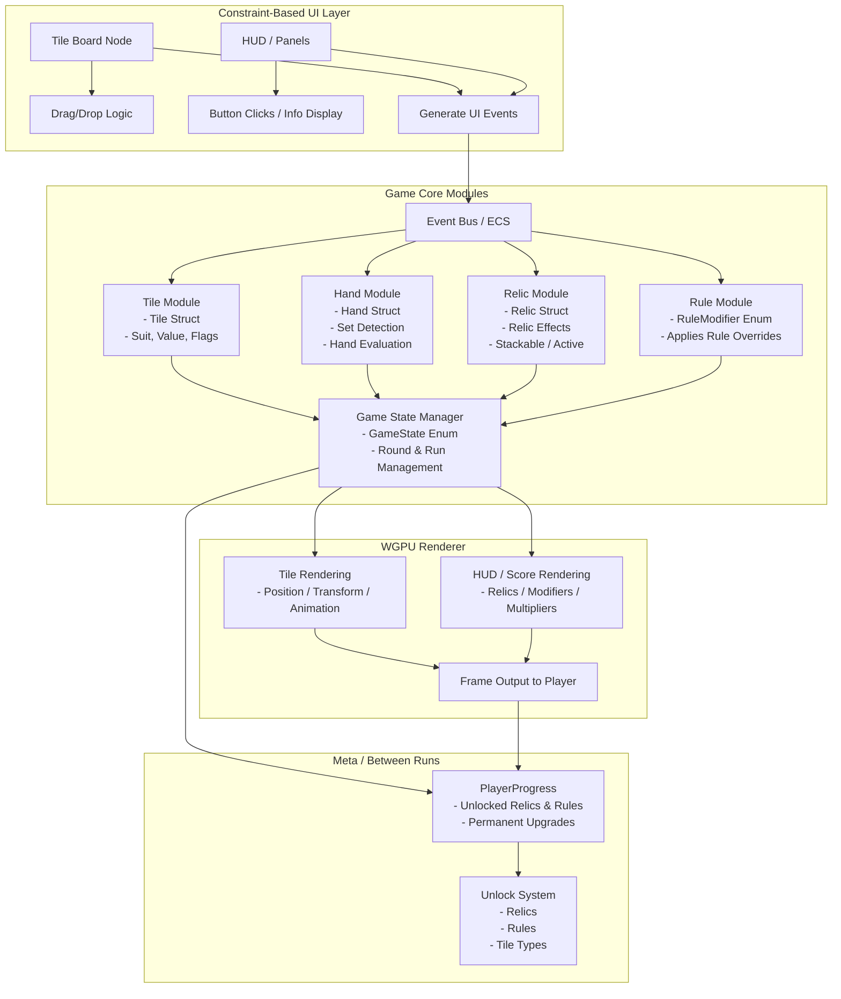

---

### **Diagram Explanation**

#### **UI Layer**

* **Tile Board Node:** Handles drag/drop of tiles.
* **HUD/Panels:** Shows score, relics, round modifiers.
* **Constraint System:** Ensures dynamic positioning and snapping.
* **Generates Events:** e.g., `TilePlayed`, `HandCompleted`.

#### **Event Bus**

* Decouples UI from core logic.
* Broadcasts events to multiple listeners (logic, renderer, audio, etc.).

#### **Game Core Modules**

* **Tile Module:** Represents tile data (`Suit`, `Value`, flags for wild/cursed).
* **Hand Module:** Detects sets, sequences, pairs, and evaluates hands.
* **Relic Module:** Stores relic effects, stackability, activation rules.
* **Rule Module:** Applies temporary or permanent rule modifiers.
* **Game State Manager:** Tracks the current run, round, player turn, and overall game state.

#### **Progression / Meta Layer**

* Stores **unlocks, relics, rules, permanent upgrades**.
* Handles **post-run unlocks** and updates `PlayerProgress`.

#### **Renderer (WGPU)**

* **Tile Rendering:** Position, animation, highlighting, snapping.
* **HUD Rendering:** Displays relics, score, multipliers.
* **Frame Output:** Sends final frame to player.

#### **Feedback Loop**

* End-of-run updates are sent to progression system → new relics/rules unlock → affect future runs.
