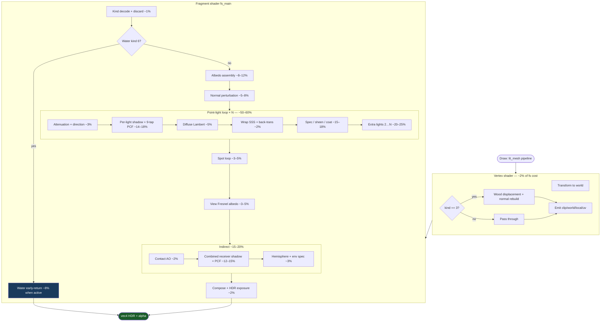

# Lit mesh shader (`lit_mesh.wgsl`)

One WGSL program powers almost all procedural 3D props (candles, table, coins, talismans, books, shop stock, etc.). The CPU uploads per-draw transforms and a `material_kind` float; the fragment shader branches on that value. Rust-side types and builders live in [`lit_mesh.rs`](../../crates/mahjuro-render/src/lit_mesh.rs).

At runtime the shader is composed with shared PBR helpers and projected shadows:

```text
scene_pbr_core.wgsl
  + scene_pbr_lights.wgsl
  + lit_mesh.wgsl
  + projected_shadow.wgsl
```

See [`embedded_wgsl.rs`](../../crates/mahjuro-render/src/wgpu_renderer/embedded_wgsl.rs) (`LIT_MESH`). Output is **linear HDR** (`Rgba16Float` scene color). ACES tonemapping happens once in `tonemap_composite.wgsl`.

Related notes: [cap-mesh coordinates](cap-mesh-coordinates.md) (talisman/relic UV + normal conventions), [memorial talisman art](memorial-talisman-art.md) (chitin heightmaps), [room shadows & baking](room-shadows-and-baking.md) (contact AO + live punctual shadows).

---

## Bind groups

| Group | Bindings | Purpose |
|-------|----------|---------|
| **0** | 0 `MeshUniform`, 1 `albedo_tex`, 2 sampler, 3 `relief_tex` | Per-instance transform, material params, textures |
| **1** | 0 `PointLights` (≤16), 1 `TileOccluders` (≤16 AABBs) | Punctual lights + tile AABB buffer (occlusion fn exists but is unused — see [Dead code](#dead-code)) |
| **2** | projected-shadow resources | Per-light depth maps, contact AO, combined receiver shadow |
| **3** | 0 `SpotLights` (≤8), 1 `LitMeshFrameGlobals` | Spotlights + camera/HDR/shop/profile flags |

### `MeshUniform`

| Field | Role |
|-------|------|
| `view_proj`, `model`, `normal_model` | Standard transform + inverse-transpose normal matrix |
| `base_color` | Instance tint; `.a` carries opacity (book open amount, etc.) |
| `material_params.x` | `material_kind` (see [Material kinds](#material-kinds)) |
| `material_params.y` | `specular_strength` (emissive scale for kind 20) |
| `material_params.z` | `specular_power` |
| `material_params.w` | Decal flag (`> 0.5`) for engraved overlays; talisman kind index (memorial adds 128) |
| `instance_params.x` | Bronze play mirror jade glow when a valid hand is shown |

### `LitMeshFrameGlobals` (group 3)

- `view_pos` — camera for view-dependent effects
- `hdr_tonemap` — `(ACES path, linear exposure, ambient scale, _)`
- `shop_punctual` — `(1/doc_scale, catalog balance flag, catalog ambient mul, profile flags)`

Profile flags (`lit_mesh_profile.rs`, via `MAHJURO_LIT_MESH_PROFILE`): disable per-light shadow, combined receiver shadow, specular, or cap to one light. See [Profiling](#profiling-relative-cost).

### Texture slots

- **`albedo_tex`**: albedo, heightmap (metal/coins), or talisman relief depending on material
- **`relief_tex`**: linear material map — `.r` height, `.g` spec mask/roughness, `.b` material-specific mask (catalog-paper embroidery thread)

---

## Material kinds

Discriminants match `MaterialKind` in [`lit_mesh.rs`](../../crates/mahjuro-render/src/lit_mesh.rs):

| Kind | Name | Summary |
|------|------|---------|
| 0 | Plain | Lit base color × albedo |
| 1 | Wax | Fake SSS + back-transmission |
| 2 | Wick | Dark, no specular |
| 3 | LacqueredWood | Procedural ring grain + VS displacement + clearcoat |
| 4 | LacqueredWoodFlat | Same wood albedo, no vertex displacement |
| 5 | Metal | Tinted Fresnel conductor + heightmap normals (coins) |
| 6 | Water | Early-return branch: stone trough vs animated river |
| 7 | PackWrap | Clear plastic sleeve + front decal |
| 8 | Foil | Metallic + anisotropic streaks + holo band |
| 9 | Glass | Fresnel rim, cool tint |
| 10 | Enamel | Hard enamel pin; relief on front cap only |
| 11 | Jade | Waxy green dielectric + sheen |
| 12 | Moonstone | Schiller / adularescence |
| 13 | Pearl | Pearlescent nacre |
| 14 | GoldNugget | Pitted gold conductor |
| 15 | Polychrome | Rainbow thin-film (or score-glyph bands if `spec_power ≥ 40`) |
| 16 | Porcelain | Glaze + Voronoi crazing |
| 17 | Brass | Warm conductor, wider rim |
| 18 | Leather | Procedural grain; UV.x selects body/pages/ribbon/journal RT |
| 19 | FeltGreen | Legacy slot (unused) |
| 20 | Emissive | Additive self-illumination (`spec_strength` scales) |
| 21 | Chitin | Abalone talisman tablets |
| 22 | Unshaded | Flat atlas read, no lighting |
| 23 | BronzeMirror | Gameplay mirror: bronze + optional jade glow |
| 24 | CatalogPaper | Shop washi/ribbon paper + relief map |

`material_casts_shadow()` opts out `Emissive` and `Unshaded` from the directional shadow map.

---

## Vertex shader (`vs_main`)

Inputs: position, normal, UV, tangent pad.

1. Transform normal and position to world space.
2. **Kind 3 only** (`LacqueredWood`): displace world Z by procedural `wood_height_world`, rebuild normal from finite differences (1.6 world-unit amplitude). Kind 4 skips this.
3. Emit clip position, world pos/normal, **undisplaced** local pos (for consistent wood sampling), UV, local normal.

---

## Fragment shader — phases

### 1. Kind dispatch & early exits

- Decode ~25 material booleans from `material_params.x`.
- **Chitin front cap**: discard where relief mask `< 8/255`.
- **Enamel / Unshaded front cap**: discard cut-out alpha.
- **Water (6)**: full custom path — stone vs water, own light loops, early `return`.
- **Unshaded (22)**: skip all lighting at compose time.

### 2. Albedo assembly

Per-kind overrides on top of default `base_color × albedo_tex`:

- **Decal path** (`has_decal`): procedural base + gold-leaf channel composite
- **Wood**: procedural `wood_sample` / `wood_sample_world`
- **Leather**: UV.x branches (body grain, page edge, silk ribbon, journal screen-space sample from `relief_tex`)
- **PackWrap / Foil / Glass / Enamel / Chitin / CatalogPaper**: each has dedicated tint/mask logic
- **Porcelain**: Voronoi crazing albedo + stain
- **Score glyphs** (`Polychrome` + `spec_power ≥ 40`): animated diagonal bands

### 3. Normal perturbation

Applied in sequence where relevant:

| Source | Materials |
|--------|-----------|
| Decal alpha gradient | Carved gold-leaf decals |
| Leather noise FD | Leather body |
| Relief map FD | Catalog paper, enamel, metal coins, bronze mirror, talismans |
| Porcelain crack FD | Porcelain |
| Procedural wood VS | Kind 3 table (already in VS) |

### 4. Direct lighting loops

For each **point light** (up to 16):

1. `scene_pbr_sample_point_light` — smooth or KHR inverse-square attenuation
2. **`punctual_shadow_vis`** — projected depth map per light (group 2)
3. Lambert diffuse (`scene_punctual_diffuse_weight`)
4. Optional **wrap SSS** (wood, wax, jade, moonstone, pearl, chitin, porcelain, leather, …)
5. Optional **Penner back-transmission** (wax, talisman gems)
6. **Blinn–Phong specular** — material-specific branches (conductor Schlick, enamel ridges, glass/pack/porcelain/leather/catalog paper, foil, bronze mirror, decal gold)
7. **Clearcoat** (wood only) — white dielectric lacquer lobe
8. **Talisman sheen** — jade/moonstone/pearl/gold/poly/chitin iridescence stacks
9. Shop **probe irradiance** accumulation for catalog stock

Then a parallel **spotlight loop** (≤8) with the same diffuse/SSS/back/spec/coat terms (no per-light shadow on spots in this path).

### 5. Compose direct + indirect

```text
direct = albedo × lit × diffuse_scale × contact_AO
       + sss_acc × sss_tint
       + back_acc × back_tint
       + spec + coat + sheen
       + emissive
indirect = scene_world_hemisphere_lighting(...) × diffuse_scale × contact_AO × room_receiver_shadow
         + scene_environment_radiance(...) specular indirect
         + catalog_probe_indirect (shop only)
```

- **`sample_contact_ao`**: offline `.msh` contact grounding (weaker for shop catalog stock)
- **`dynamic_receiver_shadow_vis`**: dims ambient/indirect when receiver is in combined shadow
- Per-material **`diffuse_scale`** suppresses diffuse on conductors, glass, moonstone, score glyphs, etc.
- Wood gets Reinhard knees on diffuse, coat, and spec to prevent milky highlights

### 6. View-dependent albedo finishing

Fresnel rim tints applied before final compose for: talismans, score glyphs, enamel, pack wrap, foil, glass, metal, brass, leather.

Bronze mirror adds view-facing Schlick rims + optional jade glow (`instance_params.x`).

### 7. Output encoding

- **HDR path** (`hdr_tonemap.x > 0.5`): multiply by linear exposure, clamp to 65000 (Metal bloom safety), no in-shader gamma
- **Legacy path**: `pow(rgb, 1/gamma)` using `lights.extras.x`
- Alpha from `base_color.a`

---

## Procedural helper library (in-shader)

| Helper | Role |
|--------|------|
| `hash*`, `vnoise2`, `noise3`, `fbm2` | Grain, pitting, water, leather |
| `voronoi2_edge` | Porcelain crazing |
| `wood_basis*` / `wood_sample*` | Table + plaque lacquer |
| `themed_holo`, `themed_abalone`, `talisman_holo_phase*` | Talisman iridescence |
| `score_glyph_band_albedo` | HUD score pop colour sweep |
| `saturate_rgb`, polychrome base detectors | House/Yen token styling |

Shared from **`scene_pbr_core.wgsl`**: point/spot sampling, Fresnel, hemisphere lighting, environment radiance, IGN jitter.

Shared from **`projected_shadow.wgsl`**: `punctual_shadow_vis`, `sample_contact_ao`, `dynamic_receiver_shadow_vis`.

---

## Dead code

`candle_occlusion` + `TileOccluders` implement analytic tile AABB ray tests but are **not called** from the current light loop — shadowing uses projected depth maps instead. The buffer is still bound (group 1 binding 1).

---

## Profiling relative cost

GPU timestamps measure whole **passes**, not individual WGSL blocks. Use `MAHJURO_LIT_MESH_PROFILE` A/B toggles (see [`lit_mesh_profile.rs`](../../crates/mahjuro-render/src/lit_mesh_profile.rs)) to attribute cost to shader phases.

### Reproduce

```bash
./scripts/profile-lit-mesh-inspect.sh
```

Default scene: shop relic inspect @ 1280×720, Visuals, high shadows, 40 GPU-profile frames (`MAHJURO_HEADLESS_GPU_PROFILE_FRAMES`).

### Profile tokens → shader phase

| Token | Shader phase affected |
|-------|-------------------------|
| `one_light` | Point+spot loops for lights 2…15 (diffuse + shadow + spec + SSS per extra light) |
| `no_per_light_shadow` | `punctual_shadow_vis()` inside point loop |
| `no_combined_shadow` | `dynamic_receiver_shadow_vis()` on indirect only |
| `no_spec` | Blinn–Phong + material spec + sheen + clearcoat + foil + decal gold in loops |
| `no_pcf` | 9→1 tap on **all** `sample_projected_depth` (tiles + room + lit_mesh) |
| `no_shadow` | Both shadow toggles (`no_per_light_shadow` + `no_combined_shadow`) |
| `diffuse_only` | All of the above shadow + spec toggles combined |

Comma-separate tokens (e.g. `no_pcf,no_per_light_shadow`).

### Measured main-pass deltas

Shop relic inspect @ 1280×720, Visuals/high shadows, **Metal**, 3-run mean (`main` pass ms). Baseline **main ≈ 3.48 ms** (high run-to-run variance on baseline; subtraction deltas are tighter).

| Profile toggle | Δ main vs baseline | Share of baseline |
|----------------|-------------------:|------------------:|
| `no_pcf` | **−1.37 ms** | **39%** |
| `one_light` | **−0.86 ms** | **25%** |
| `diffuse_only` | **−0.77 ms** | **22%** |
| `no_spec` | **−0.58 ms** | **17%** |
| `no_per_light_shadow` | **−0.55 ms** | **16%** |
| `no_combined_shadow` | **−0.48 ms** | **14%** |
| Shadow pass | **~0.02 ms** | **<1%** |

**Caveats:**

- `no_pcf` is **scene-wide** (tiles, room, lit_mesh). Other toggles affect **lit_mesh fragments only** — their deltas are diluted by non–lit-mesh draws still in the main pass.
- Shadow **cost lives in main-pass sampling**, not the ~0.02 ms shadow depth pass.
- On Visuals, `sample_projected_depth` uses **9-tap PCF** (`shadow_globals.params.z > 0`); `no_pcf` forces single-tap compare.

**Floor check:** `diffuse_only` ≈ **2.72 ms** main — albedo, normals, multi-light diffuse, and indirect with shadows/spec stripped (~78% of baseline).

### Estimated share within `fs_main` (enamel relic inspect)

Structural estimate calibrated to A/B deltas. Percentages are of **lit-mesh fragment work**, not the whole frame.

| Phase | Est. share | Evidence |
|-------|----------:|----------|
| **Point-light loop (all lights)** | **50–60%** | Dominant `for` loop; `one_light` −25% main |
| ↳ Per-light projected shadow + PCF | 14–18% | `no_per_light_shadow` −16% |
| ↳ Spec / sheen / clearcoat / decal gold | 15–18% | `no_spec` −17% |
| ↳ Extra lights (2…N) | 20–25% | `one_light` −25% |
| ↳ Diffuse + wrap-SSS | 5–8% | Cheap vs spec/shadow |
| **Indirect block (once/pixel)** | **15–20%** | After loops |
| ↳ Combined receiver shadow + PCF | 12–15% | `no_combined_shadow` −14% |
| ↳ Contact AO + hemisphere + env spec | 3–5% | No toggle; structurally lighter |
| **Albedo + normal setup** | **12–18%** | Texture samples, enamel relief FD |
| **View Fresnel albedo finish** | **3–5%** | ALU-only rim tints |
| **Kind dispatch / early discard** | **<2%** | Branch + occasional discard |

---

## Pipeline flowchart



Percentages are approximate, from [Profiling relative cost](#profiling-relative-cost) on shop relic inspect (enamel). Other materials shift weight (e.g. chitin adds sheen; water early-returns).

---

## Design notes

- **One pipeline, many looks** — all props share bind layouts; only uniforms and bound textures change.
- **Candle-first lighting** — diffuse starts at zero; warm pools come from point lights (same family as `tile_3d.wgsl`).
- **No in-shader tonemap on HDR path** — keeps bloom/composite consistent.
- **Shop catalog balance** — storeroom shelf props get boosted ambient + punctual probe so authored art stays readable under HDR (`shop_catalog_balance` in `lit_mesh.rs`).
- **Headless profiling** — `MAHJURO_LIT_MESH_PROFILE` + `scripts/profile-lit-mesh-inspect.sh` for cost isolation; see [launch options](launch-options.md).
