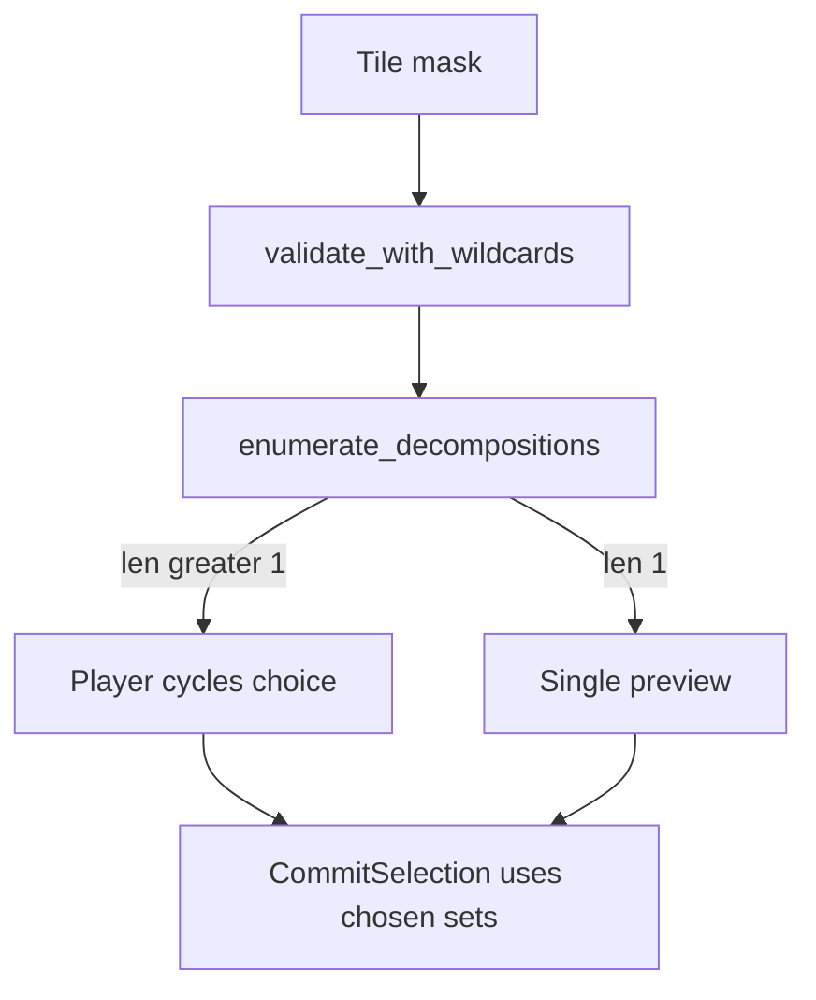

# Meld grouping preview and picker

## Problem

Selection is a **tile bitmask** ([`RunState.selected`](src/game/run.rs)); validity is global ([`validate_selection_with_rules`](crates/mahjuro-core/src/core/hand/validation.rs)). The hand UI only shows selected vs hinted vs invalid — **no meld boundaries**.

On commit, [`commit_selection_to_structure`](src/game/run/scoring_flow.rs) may replace the validator’s first split via [`pick_best_decomposition`](src/game/run/scoring_flow.rs) (`enumerate_decompositions` + hand bias / full-hand score). Previews today do **not** use that path:

- Yaku tablets merge `GameEngine::validate_with_wildcards`’s first `sets` ([`build_yaku_panel_and_tablets`](src/scenes/gameplay/input_handler.rs) ~1346–1358).
- Play cascade showcase also uses raw validation ([`ScoreHand`](src/scenes/gameplay/input_handler.rs) ~631–644).

For cases like **six 6s** (`666S` × 2 mentally), multiple partitions exist (e.g. **Kong + Pair** vs **Triplet + Triplet**). With neutral hand bias, partial plays keep the backtracker’s first result (kong-first) without enumerating — surprising if the player expected two triplets.



## Approach

### 1. Single resolution API (game layer)

Add on [`RunState`](src/game/run.rs) / [`GameEngine`](src/game/engine.rs):

- **`selection_decomposition_alternatives()`** → `Option<SelectionGrouping>` where:
  - Run `try_validate_with_wildcards` on current selection; if invalid, return `None`.
  - `enumerate_decompositions(scoring_tiles, validation_rules_for_structure_commits())`.
  - If empty, fall back to validator `sets` as a single alternative.
  - **`default_index`**: index of `pick_best_decomposition(validator_sets, …)` in the alternatives list (stable sort alternatives for deterministic cycling).
- **`chosen_selection_sets()`** → `alternatives[choice_index]` (clamped).

**Persist choice** on run state (reset when selection or hand identity changes):

```rust
// run.rs (conceptual)
meld_grouping_choice: usize,
last_grouping_selection_key: u64, // hash of selected tile ids (+ relic wildcard generation if needed)
```

On any selection mutation ([`toggle_select`](src/game/run/hand_ops.rs), marquee, clear, refill): recompute key; if key changed, set `choice = default_index`.

**Commit path** ([`commit_selection_to_structure`](src/game/run/scoring_flow.rs)): after validation, use `chosen_selection_sets()` instead of `pick_best_decomposition` when alternatives were enumerated; keep `pick_best_decomposition` only to compute the default index (or inline default pick once).

Extract `pick_best_decomposition` to a small shared helper in [`scoring_flow.rs`](src/game/run/scoring_flow.rs) or [`hand_ops.rs`](src/game/run/hand_ops.rs) so preview default and commit default cannot drift.

### 2. Visual preview (two surfaces)

**A. Hand — meld tint (always when valid and `sets.len() >= 2` in the *selection portion*)**

In [`scene_behavior.rs`](src/scenes/gameplay/scene_behavior.rs) hand `ShowcaseTilePlacement` loop (~866–918):

- Map `tile.id → meld_index` from `chosen_selection_sets()` (selection melds only).
- For selected slots, set distinct `glow_color` per meld index (reuse existing per-tile override; keep invalid-flash red overriding).
- Optional: slightly increase gap feel by nudging `center_pos` per meld cluster (only if cheap; tint alone may suffice).

**B. Structure strip — grouped layout (when banked structure exists OR selection preview needs strip)**

Reuse existing meld layout in [`build_yaku_panel_and_tablets`](src/scenes/gameplay/input_handler.rs) (`intra_gap` / `inter_gap` over `showcase.sets`):

- While selection is valid, build **`CascadeShowcase`** = committed structure + **chosen** selection melds (display tiles via `GameplayScene::display_tiles`).
- Feed that into `structure_showcase` instead of only `gameplay.structure_sets`.
- Extend [`showcase_present`](src/scenes/gameplay/scene_behavior.rs) (~402) so the HUD reserves structure-strip height when a valid multi-meld selection is active (avoids “no strip on first play”).

Pending selection tiles: slightly dimmer `brightness` (e.g. `0.85`) vs committed structure tiles so “about to play” reads clearly.

### 3. Player picker (when `alternatives.len() > 1`)

**HUD chip row** near the structure strip / play affordance (new small module, e.g. `src/scenes/gameplay/meld_grouping_picker.rs`):

- One chip per alternative, label from existing [`format_meld_groups`](crates/mahjuro-core/src/core/scoring/mod.rs) (`"Triplet 6s 6s 6s · Triplet 6s 6s 6s"`).
- Highlight active `meld_grouping_choice`.
- Register as `FlatItem` / `FocusTarget::MeldGrouping(usize)` in the gameplay focus graph ([`widget-tree.md`](docs/agents/widget-tree.md) pattern).

**Input**

- New `UiAction::CycleMeldGroupingPrev` / `CycleMeldGroupingNext` in [`ui_action.rs`](crates/mahjuro-types/src/ui_action.rs).
- Bind to **`,` / `.`** (keyboard) and **unused gameplay-safe gamepad input** (e.g. **PageUp / PageDown** or **right stick click** — verify no conflict in [`input.rs`](src/ui/input.rs); avoid stealing LB/RB consumable cycle).
- Click chip → set choice index.
- Controller hint row via [`action_prompts.rs`](src/scenes/gameplay/action_prompts.rs) only while ambiguous (`"Cycle grouping , ."`).

Wire cycle handlers in [`input_handler.rs`](src/scenes/gameplay/input_handler.rs) `update()` (guarded: cascade inactive, valid selection, `alternatives.len() > 1`).

### 4. Keep previews consistent

Replace all “selection melds” paths to use `chosen_selection_sets()`:

| Call site | File |
|-----------|------|
| Yaku preview merge | [`input_handler.rs`](src/scenes/gameplay/input_handler.rs) `build_yaku_panel_and_tablets` |
| Play cascade showcase | [`input_handler.rs`](src/scenes/gameplay/input_handler.rs) `ScoreHand` |
| Bot / tests (optional) | [`bot.rs`](src/bot.rs) logging only |

### 5. Tests

- **Core**: extend [`hand/tests.rs`](crates/mahjuro-core/src/core/hand/tests.rs) — six identical souzu 6s → `enumerate_decompositions` len ≥ 2 (kong+pair vs two triplets).
- **Run**: [`run/tests.rs`](src/game/run/tests.rs) — given hand + selection, `default_index` matches `pick_best_decomposition`; cycling changes `chosen_selection_sets`; commit banks chosen partition.
- **Regression**: yaku preview uses chosen sets (e.g. Iipeikou vs Ryanpeikou-sensitive partition differs by choice).

### 6. Docs

Short subsection in [`docs/agents/scoring.md`](docs/agents/scoring.md): ambiguous plays show grouping; comma/period (and chips) cycle before Play.

## Out of scope (follow-ups)

- Changing neutral partial **auto** policy to always enumerate without player input (picker supersedes for explicit choice).
- Tutorial/onboarding beat for grouping (could reuse [`melds_intro_copy.rs`](src/scenes/melds_intro_copy.rs) later).

## Risk notes

- **HUD layout jump** when first multi-meld selection expands `showcase_present` — acceptable if strip reserved early; tune in `glb_anchors.rs` if jarring.
- **Performance**: `enumerate_decompositions` on every frame is fine for ≤14 tiles; if profiling complains, cache on `last_grouping_selection_key` only.
